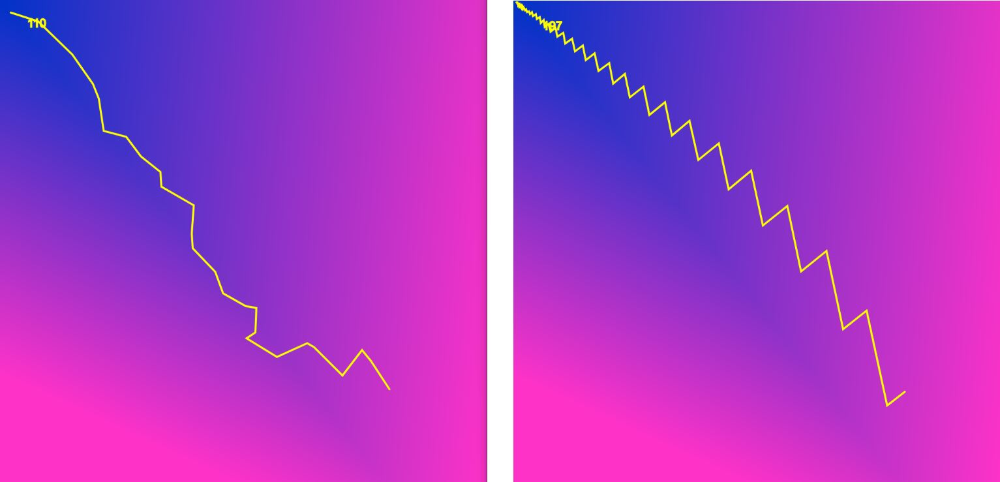
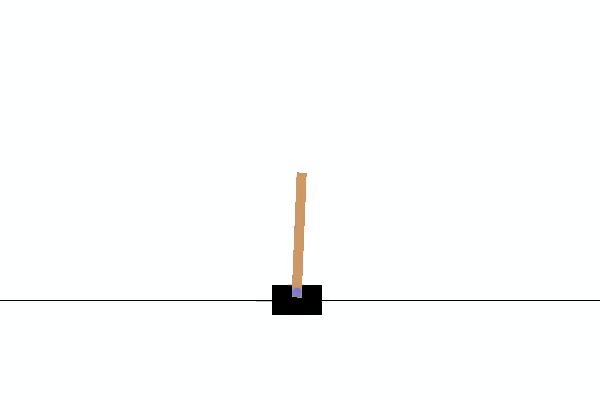

# Genetic Algorthim
A simple evolutionary-genetic algorithm (Simultaneous update of all the weights) implemented both in python and C++.
The algorithm is very simple conceptually. it competes between two networks: a parent (f) & a child (c) network. It simultaneously mutates all the weights of the child network then chooses the better network to become the parent of the next generation. For low dimensional data, this algorithm can be as efficient as naive gradient descent and that is because it doesn't require the backward pass (back-propagtion), instead it requires 2 forward passes (which are less intensive computationally than a forward+backward pass). Also, if the loss function is not convex or the local minima hides in a narrow and elongated groove, then this algorithm can be more efficient than the naive gradient descent which produces a zigzagged path towards the minima as shown in the figure below (right: genetic algorthim, left: stochastic gradient descent).

 

For a detailed comparision between GA vs SGD please refer to this article:

https://www.brainxyz.com/machine-learning/genetic-algorthim/

**Files:**

1. *very_simple_GA.py:* This file contains a very simple GA implemenation using numpy (few lines of code). It solves the XOR problem.

2. *Solve_Xor_and_Cartople.py:* This file implements GA from scratch using object oriented principles which gives more flexibility to structure the network and It has been showcased to solve clasififcation problems (Xor) and reinforcement learning (Cartople) using the same code base. You need to install OpenAI's gym library to run the Cartpole example.

3. *Solve_Xor.cpp:* a C++ implentation of the same code above.

 

For more visit us at: https://www.brainxyz.com/ 
